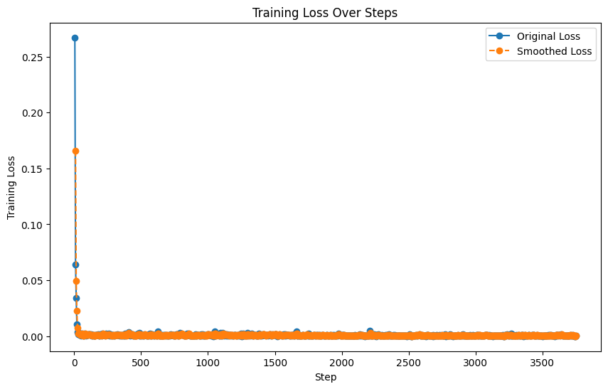

# Using this model
Install PEFT:
```
pip install peft

```

```
from peft import PeftModel, PeftConfig
from transformers import AutoModelForCausalLM

config = PeftConfig.from_pretrained("Rajan/training_run")
base_model = AutoModelForCausalLM.from_pretrained("NumbersStation/nsql-350M")
model = PeftModel.from_pretrained(base_model, "Rajan/training_run")

```

<!-- This model card has been generated automatically according to the information the Trainer had access to. You
should probably proofread and complete it, then remove this comment. -->

# training_run

This model is a fine-tuned version of [NumbersStation/nsql-350M](https://huggingface.co/NumbersStation/nsql-350M) on an custom dataset.

## Training procedure

### Training hyperparameters

The following hyperparameters were used during training:
- learning_rate: 0.0001
- train_batch_size: 8
- eval_batch_size: 8
- seed: 42
- gradient_accumulation_steps: 2
- total_train_batch_size: 16
- optimizer: Adam with betas=(0.9,0.999) and epsilon=1e-08
- lr_scheduler_type: linear
- num_epochs: 2

### Training results

**Loss Per Step**



### Framework versions

- PEFT 0.12.0
- Transformers 4.42.3
- Pytorch 2.1.2
- Datasets 2.20.0
- Tokenizers 0.19.1


